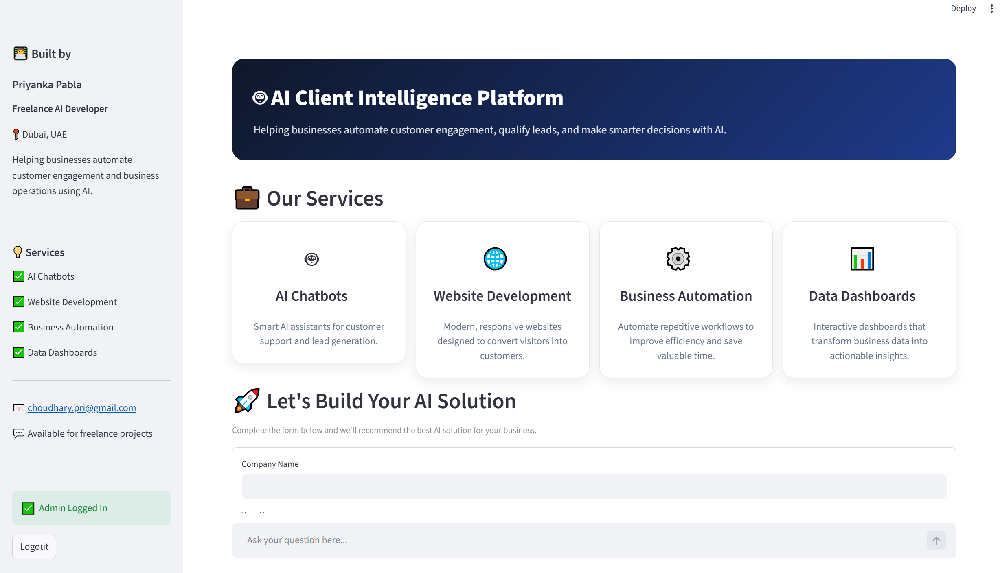
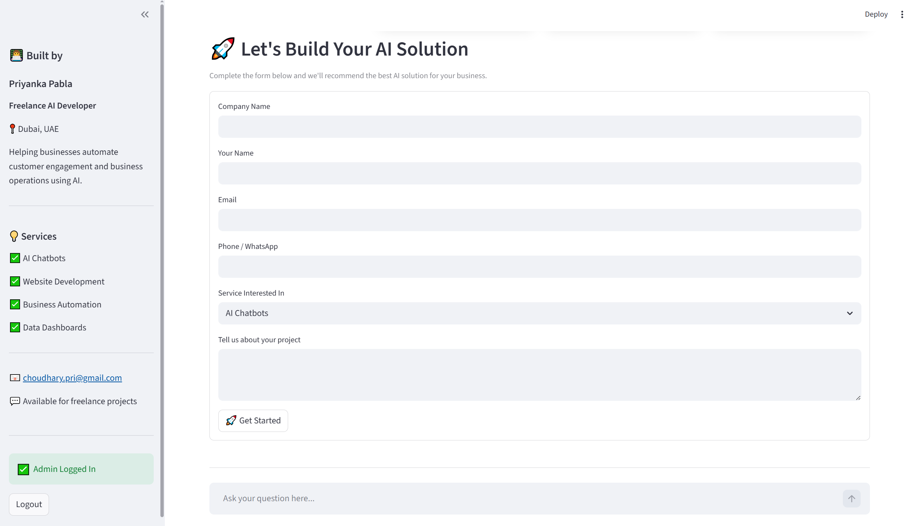
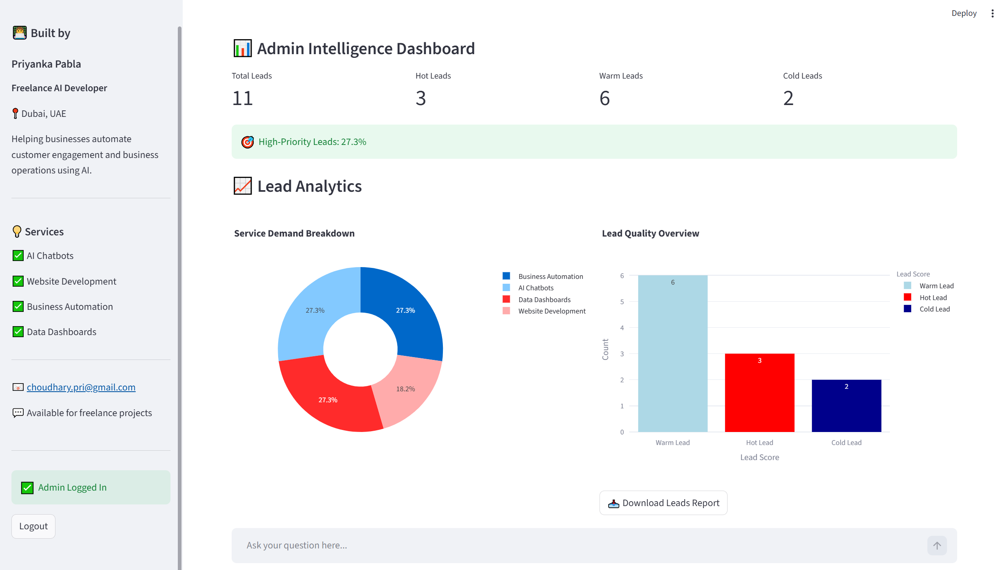
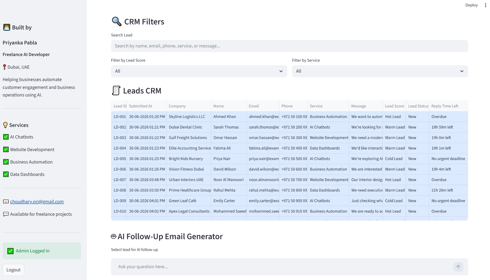
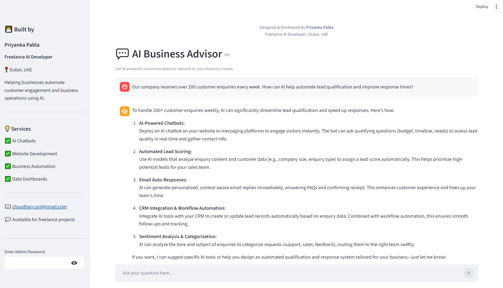
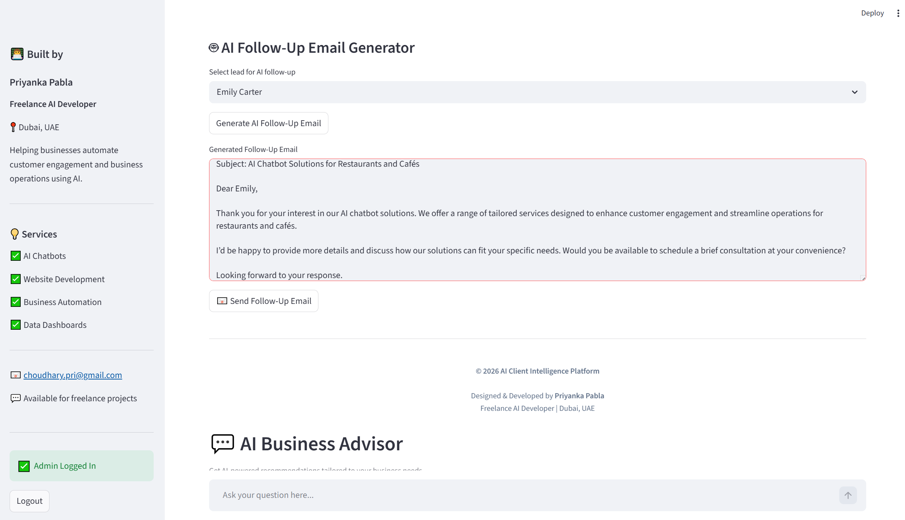

# AI Client Intelligence Platform

An AI-powered lead management and business intelligence platform built with Python and Streamlit.

The platform enables businesses to capture customer enquiries, automatically qualify leads, manage customer relationships (CRM), generate AI-powered follow-up communication, and gain actionable business insights through an interactive analytics dashboard.

---

## Key Features

- Lead enquiry capture form
- Automatic lead scoring (Hot, Warm, and Cold)
- Admin Intelligence Dashboard
- CRM lead status management
- CRM search and filtering
- Service demand analytics
- Lead quality analytics
- Conversion tracking
- Recent activity monitoring
- Reply SLA tracking
- AI-generated follow-up emails
- Automated customer acknowledgement emails
- Automated admin lead notification emails
- AI Business Advisor chatbot
- CSV-based lead storage
- Responsive Streamlit interface

---

## Technologies Used

- Python
- Streamlit
- Pandas
- Plotly
- OpenAI API
- HTML & CSS
- Git & GitHub

---

## Project Screenshots

### Homepage



### Lead Capture



### Admin Dashboard



### CRM Management



### AI Business Advisor



### AI Follow-up Email Generator



---

## Project Structure

```text
ai-client-intelligence-platform/
│
├── assets/
│   └── screenshots/
│
├── data/
│   └── leads.csv
│
├── utils/
│   ├── __init__.py
│   ├── date_utils.py
│   └── scoring.py
│
├── .gitignore
├── README.md
├── requirements.txt
└── streamlit_app.py
```

---

## Installation

Clone the repository:

```bash
git clone https://github.com/priyanka-pabla/ai-client-intelligence-platform.git

cd ai-client-intelligence-platform
```

Install the required packages:

```bash
pip install -r requirements.txt
```

Run the application:

```bash
streamlit run streamlit_app.py
```

---

## Environment Variables

Create the following file locally:

```text
.streamlit/secrets.toml
```

Add the required credentials:

```toml
OPENAI_API_KEY="your_openai_api_key"

EMAIL_ADDRESS="your_email@gmail.com"

EMAIL_APP_PASSWORD="your_gmail_app_password"

ADMIN_EMAIL="your_email@gmail.com"

ADMIN_PASSWORD="your_admin_password"
```

**Note:** These credentials are not included in this repository and should never be committed to GitHub.

---

## Lead Intelligence Workflow

1. Customer submits an enquiry.
2. Lead information is stored securely.
3. The platform automatically classifies the lead as Hot, Warm, or Cold.
4. Customer receives an acknowledgement email.
5. Admin receives a lead notification email.
6. The Admin Dashboard provides business insights and analytics.
7. Lead status is updated through the built-in CRM.
8. AI generates professional follow-up emails.
9. The AI Business Advisor answers customer questions.

---

## Use Cases

- Freelancers
- AI Consultants
- Digital Agencies
- Service-Based Businesses
- Sales Teams
- Small & Medium Businesses

---

## Future Enhancements (Version 2)

- Machine Learning-based lead conversion prediction
- Predictive lead scoring using historical CRM data
- Appointment booking integration
- Database integration
- Multi-user authentication
- Advanced analytics and reporting
- Workflow automation
- Custom branding and white-label support

---

## Data Privacy

Sensitive credentials such as API keys, email passwords, and admin passwords are securely managed using Streamlit Secrets and excluded from version control through `.gitignore`.

The repository contains only demonstration data.

---

## Developed By

**Priyanka Pabla**

Freelance AI Developer

Dubai, UAE